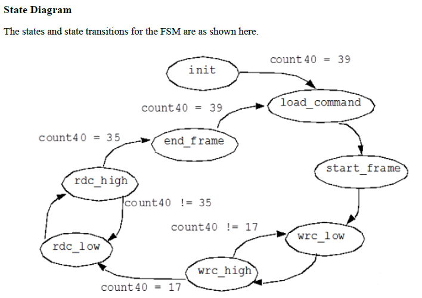

# Formal Verification of an FSM using auxillary logic

In this repository an arbitrary FSM is formally verified.

Formal verification employs mathematical analysis to explore the entire space of
possible simulations. Properties are defined to specify the design behavior, and
assertions are used to instruct the formal tool to verify that these properties
always hold true.

## HDL

`fsmWithBugs.sv` is an arbitrary FSM that could contain bugs. Below is the FSM
state diagram.



## TB

`fsmTb.sv` is the top level Tb module. The module instances the DUT and
`fsmAssertions.sv` which contains the properties and assertions. The top level Tb
drives `count40_q` to constrain it to legal values and drives both submodules
with the same inputs.

`fsmAssertions.sv`  contains ONLY synthesizable auxillary logic i.e does not
contain implication operators or time delays.

Note: Properties were written in this manner as Verilator has limited support
for the `property` keyword. However, they can be replaced to the widely used
method eg -

```
property <prop_propertyName>
  @(posedge i_clk) <assert_aseertionName>
endproperty

assert property(<prop_propertyName>);
```
## Makefile

Prerequisites: Verilator, JasperGold FPV

Lint TB and design: `make lint`

Formally verify assertions: `make formal` (all assertions should pass).
